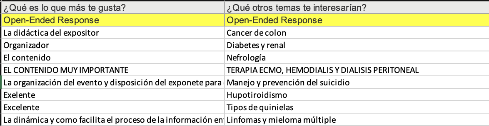
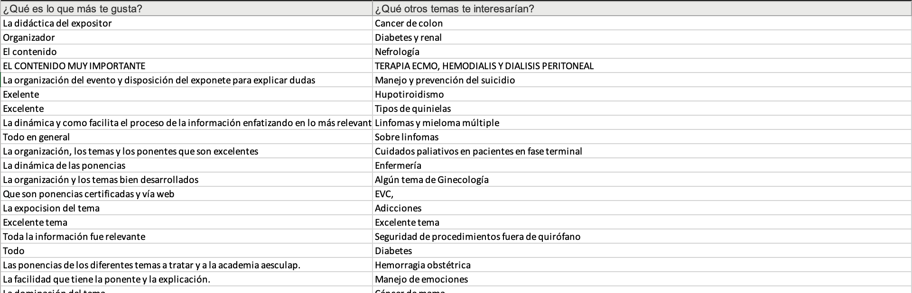

# Reporting Opportunity Areas (Webinar Answers) 💻

####Author : Daniel Malváez

**README** language available :

> * English
> * Español

Futuras versiones : Agregar un argumento para el número de palabras en cada tópico.

**English**
-------------------------
### Objective:

### Especific Objectives:

### Challenges:

### Instructions:

1. The very first step is to recollect the data from all the montlhy surveys.
2. Modify the column's names (because we have two rows as header that make gropus, because each column that is a question in the survey has a type depending on the possible answers. We have *Response*, *Otro (especifique)*, *Open-Ended Response*).

	For example: 
	* Especialidad: (Response)
	* Especialidad: Otro (especifique)

	For all those that are *Open-Ended Responses* we don't modify
	anything.

3. After we modify the column's names until it is possible, we separate data, that is already structured from the data that it is not structured yet. This will allow us to analyze data in separate ways, because the type of analysis differs from structured data (descriptive) to the non-structured data that requires som NLP to understand the feelings and emotions or the nature of the response.

**Español**
-------------------------
### Objetivo:

La finalidad de este proyecto es hacer un archivo ejecutable que entregue un reporte (análisis) sobre las opiniones de un curso en una plataforma. Estas opiniones son almacenadas en diversas preguntas que se les hacen a los participantes de encuestas. Una de las preguntas a analizar es ***¿Qué es lo que más te gusta?***, la otra es ***¿Qué temas te gustaría que se abordaran en futuros webinars?***.

### Objetivo Específico:

* Desarrollar un *script* que permita descargar las librerías (python) necesarias para el análisis.
* Desarrollar un *script* que genere un archivo **pdf** con el reporte análisis (genérico) de las dos preguntas con el objetivo de identificar las áreas que más les gustan a nuestros participantes y por otro lado las áreas de oportunidad para temas en futuros webinars.

### Retos:
Este programa fue bastante sencillo de implementar, sin embargo lo más retador fue crear el reporte en pdf de resultados. Este pdf contiene imágenes de las diversas encuestas realizadas y un desglose global. Así como un análisis de tópicos dentro de nuestras diversas opiniones.

### Instrucciones:

1. El primer paso es recolectar los datos de las respuestas (formatos excel) de almenos un webinar y almacenarlo dentro de la carpeta **Survey-Results**.

2. Posteriormente para cada excel almacenado extraeremos únicamente las siguientes dos columnas : *¿Qué es lo que más te gusta?* y *¿Qué otros temas te interesarían?* (usualmente se encuentran en las columnas *AB* y *AC* de excel). Estas dos columnas serán almacenadas en otra hoja del excel renombrada como "NLP".

3. Eliminar la segunda fila pues simplemente son etiquetas de las preguntas. Anexo ejemplo.

	

4. Así, nos queda finalmente nuestra tabla para análisis final como:

	
	

5. Posteriormente, una vez que ya tenemos nuestros datos con el formato correcto, nos ubicamos en la carpeta **Scripts** y corremos el primer script:

	`/Scripts $./install-libraries.sh`
	
	Este script nos instalará todas las librerías necesarias para correr el archivo que nos generará el reporte.

6. Una vez instaladas las librerías satisfactoriamente procedemos a correr el script del análisis : 

	`/Scripts $ python3 Analisis.py`

	Y comenzará a ejecutarse el análisis. (Dependiendo de el número de opiniones a analizar tardará en tiempo - aprox 5 mins para 2775 opiniones). El proceso de ejecución será mostrado en la terminal.
	
	
7. Una vez terminada la ejecución del archivo *.py*, nos ubicaremos en la carpeta **Results**. Dicha carpeta almacenará las imágenes en formato png utilizadas en el reporte, así mismo como el reporte en formato *.pdf* con el nombre de `Areas de Oportunidad.pdf`